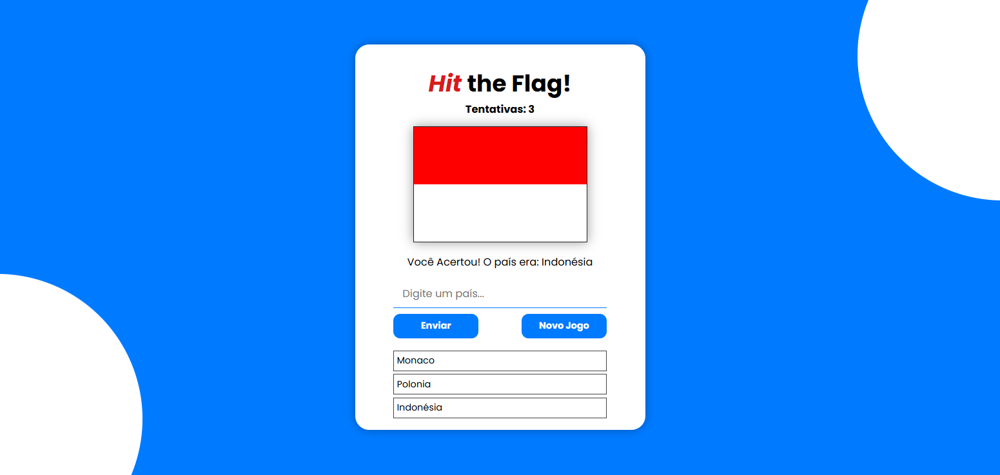

# 📚 Hit the Flag

**Hit the Flag** é um jogo simples de adivinhar o nome de um país a partir da sua bandeira. O jogador tem um número limitado de tentativas para acertar o país correto. A cada tentativa, a bandeira de um país aleatório é exibida, e o jogador deve tentar digitar o nome do país correspondente. Se acertar, o jogo revela a resposta e reinicia para uma nova rodada.

## 🕹️ Como Jogar

1. O jogo exibirá uma bandeira aleatória.
2. O jogador deve digitar o nome do país correspondente na caixa de entrada.
3. Se o jogador acertar, uma mensagem será exibida indicando que ele acertou o país.
4. O jogador tem 5 tentativas para acertar o país correto. Após 5 tentativas erradas, o jogo revelará a resposta.
5. O jogador pode reiniciar o jogo a qualquer momento clicando em "Novo Jogo".


## 🛠 Tecnologias Utilizadas

- HTML5
- CSS3
- JavaScript (Vanilla)


## 🎯 Objetivo do Projeto

Este projeto foi desenvolvido como prática pessoal para aprimar habilidades em:
- Manipulação do DOM
- Lógica de Programação
- Consumo de API
- Funções Assincronas


## ▶️ Como usar

1. Clone o repositório
```bash
git clone https://github.com/gabmacedo/hit-the-flag.git
```

2. Abra o arquivo ``index.html`` em seu navegador.


## 💡 Possiveis Melhorias

- Adicionar um contador de tempo.
- Incluir mais informações sobre o país ao acertar.
- Melhorar o design com animações ou efeitos.

## 📷 Screenshots





## 👨‍💻 Autor

- Gabriel Aparecido de Macedo

